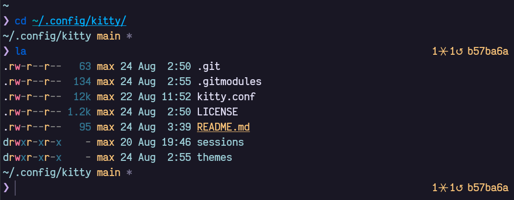

# dotfiles-fish

Configuration files for the [fish](https://fishshell.com/) shell.

<div align="center">
  
</div>

- plugins managed via [fisher](https://github.com/jorgebucaran/fisher)
- [pure](https://github.com/pure-fish/pure) prompt
  - right prompt hacked with `inspirations` by 🦸‍♂️ [reitzig/theme-dmorrell](https://github.com/reitzig/theme-dmorrell/blob/master/fish_right_prompt.fish)
    - thinking to try [jorgebucaran/hydro](https://github.com/jorgebucaran/hydro), apparently (and astonishingly) simpler than [pure](https://github.com/pure-fish/pure)
- [kitty](https://sw.kovidgoyal.net/kitty/index.html) terminal emulator
  - screenshot theme: [maxdevjs/dotfiles-kitty/themes](https://github.com/maxdevjs/dotfiles-kitty/blob/main/themes/rose-pine.conf)/[rose-pine.conf](https://github.com/rose-pine/kitty)
  - my configuration files for [it](https://github.com/maxdevjs/dotfiles-kitty)  
- `la` aliased to [exa](https://the.exa.website/) `-al`

## How to install it

When using [yadm](https://yadm.io/), add this repo as `submodule`. The general recipe is:

> NOTE: this specific command `MUST` be issued in `$HOME`

```yaml
~ $ yadm submodule add <url> path
~ $ yadm submodule update --init --recursive
```

In this specific case:

```yaml
~ $ yadm submodule add https://github.com/maxdevjs/dotfiles-fish .config/fish
~ $ yadm submodule update --init --recursive
```

## Plugins 🤪

### Plugins initilization

This repo is currently added as submodule to my [dotfiles](https://github.com/maxdevjs/dotfiles) via [yadm](https://yadm.io/).

[fish](https://fishshell.com/) plugins are managed via [fisher](https://github.com/jorgebucaran/fisher).

I encountered a `few` issues trying to bootstrap [fisher](https://github.com/jorgebucaran/fisher) 🦹‍♂️ after adding this submodule:

```yaml
~ $ yadm submodule add https://github.com/maxdevjs/dotfiles-fish .config/fish
```

Everything did 💥 putting the Multiverse in 🔥.

Theoretically I'd use [fisher](https://github.com/jorgebucaran/fisher)'s shiny `~/.config/fish/fish_plugins` file to install every needed plugin. In my case it looks something like:

```yaml
jorgebucaran/fisher
rafaelrinaldi/pure
jethrokuan/z
acomagu/fish-async-prompt
jorgebucaran/spark.fish
joseluisq/gitnow
jorgebucaran/autopair.fish
gazorby/fish-abbreviation-tips
```

Unfortunately, on its own install [fisher](https://github.com/jorgebucaran/fisher) removes any previous track of `~/.config/fish/fish_plugins`.

<details open>
<summary>Troubleshooting</summary>

<details>
<summary>If needed, get rid of the submodule 🤕</summary>

1. delete the relevant section from the `~/.gitmodules` file:

```yaml
[submodule ".config/fish"]
    path = .config/fish
    url = https://github.com/maxdevjs/dotfiles-fish
```

2. stage the .gitmodules changes

```yaml
~ $ git add .gitmodules
```

3. delete the relevant section from `~/.local/share/yadm/repo.git/config`

```yaml
[submodule ".config/fish"]
    url = https://github.com/maxdevjs/dotfiles-fish
    active = true
```

4. `yadm rm --cached ~/.config/fish` (no trailing slash)

5. `rm -rf ~/.local/share/yadm/repo.git/modules/.config/fish` (no trailing slash)

6. `yadm commit -m "Remove fish submodule"`

7. delete the now untracked submodule files `rm -rf ~/.config/fish`

🥳🎉😺🍺😋

</details>

<details open>
<summary>Current workaround 🩹</summary>

<details open>
<summary>Hooks</summary>

> NOTE: this must be set in `~/.local/share/yadm/repo.git/modules/.config/fish/hooks/`

I use [Git Hooks](https://githooks.com/) ([8.3 Customizing Git - Git Hooks](https://git-scm.com/book/en/v2/Customizing-Git-Git-Hooks) / [githooks - Hooks used by Git](https://git-scm.com/docs/githooks)), specifically the [pre-commit](https://git-scm.com/docs/githooks#_pre_commit), to:

1. backup a copy of `~/.config/fish/fish_plugins` to `~/.config/fish/fish_plugins_BACKUP`
2. `git add ~/.config/fish/fish_plugins_BACKUP`

<details open>
<summary>Setup</summary>

[setup](https://github.com/maxdevjs/dotfiles-fish/blob/main/setup) is then executed via TODO: test it [yadm](https://yadm.io/) `bootstrap` on `submodule` add/update.

The script basically does the following steps:

1. fetch, install, and update [fisher](https://github.com/jorgebucaran/fisher) (at this point [fisher](https://github.com/jorgebucaran/fisher) will create a new `~/.config/fish/fish_plugins` (eventually getting rid of any previous one))

2. copy `~/.config/fish/fish_plugins_BACKUP` over the `~/.config/fish/fish_plugins` created at step `1`

3. `fisher update` to update/install the plugins

</details>
</details>
</details>

## TODO 🤓

- I went through the [fisher.fish](https://github.com/jorgebucaran/fisher/blob/main/functions/fisher.fish) function code
  - did not seem trivial to change its behaviour on [fisher](http~/.local/share/yadms://github.com/jorgebucaran/fisher) installation

Start from [fisher update returns conflicting files errors and removes fish_plugins file #670](https://github.com/jorgebucaran/fisher/issues/670)
</details>